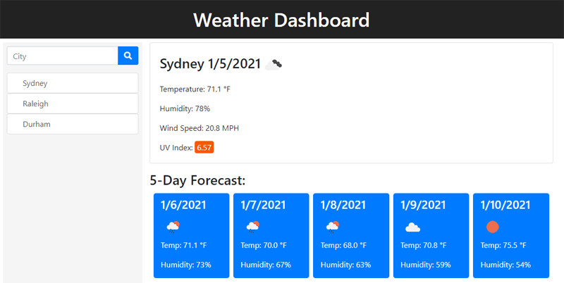

# weather-dashboard

## Description 
A web application for displaying the current weather and 5-day forecast for a given city. A search bar allows a city to be entered to find its weather. If the city is found, it is also added to a running history of previous searches. A history entry can then be clicked to bring up the weather for that city again.

It makes use of the Open Weather API as well as Bootstrap, jQuery, Moment.js, and Font Awesome.

## Screenshot

## Deployment
The web application has been deployed on GitHub as http://malenchite.github.io/weather-dashboard

## Credits
Bootstrap courtesy of https://getbootstrap.com  
jQuery courtesy of https://jquery.com  
moment.js courtesy of https://momentjs.com  
Font Awesome courtesy of https://fontawesome.com  
Open Weather API courtesy of https://openweathermap.org  

Basic page layout was provided as part of an assignment for UNC Coding Bootcamp
